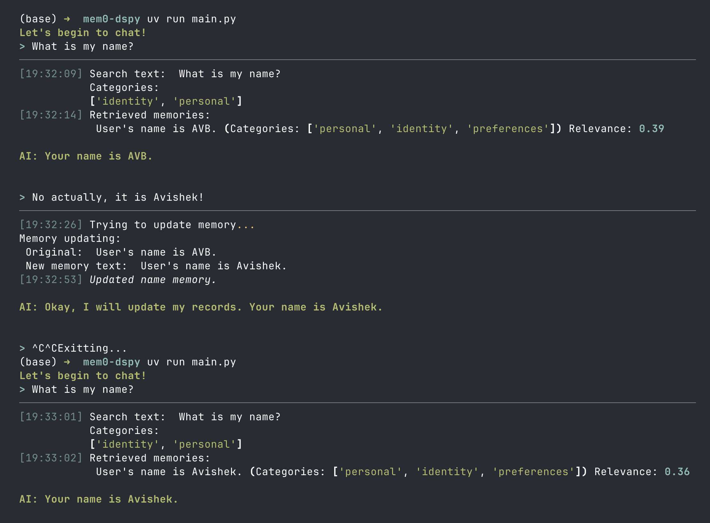
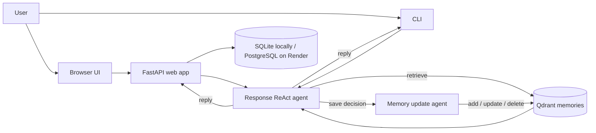

# Mem0 Memory Chatbots

`main.py` / `web_app.py` is the primary custom implementation; `local-qdrant/` and `basic_mem0_chatbot.py` are comparison baselines against Mem0.

This project contains a few small experiments with long-term memory for conversational AI. The examples use [Mem0](https://github.com/mem0ai/mem0), [Qdrant](https://qdrant.tech/), Gemini, and DSPy.

There are three separate implementations:

1. **Custom memory pipeline** - the primary example in `main.py` and `mem/`. It uses DSPy to decide when to search and update memory, Gemini for generation and embeddings, and a Qdrant collection named `memories_gemini`.
2. **Mem0 OSS with local Qdrant** - `local-qdrant/local_chatbot.py`. Mem0 manages memory extraction and storage while Gemini provides the language model and embeddings.
3. **Mem0 Cloud example** - `basic_mem0_chatbot.py`. This uses the hosted Mem0 service through `MemoryClient`.

The implementations use different models, collections, and vector dimensions. They are examples to compare, not one shared runtime.





## Prerequisites

- Python 3.10 or newer for the root project
- Python 3.12 or newer for the `local-qdrant` workspace member
- [uv](https://docs.astral.sh/uv/)
- A Qdrant server running at `http://localhost:6333`
- Network access to the model APIs used by the selected example

This repository does not include a Qdrant startup configuration. Start Qdrant separately and make sure the HTTP API is available on port `6333` before running a chatbot.

For a hosted deployment, use a managed Qdrant instance and set `QDRANT_URL` and, when required, `QDRANT_API_KEY`. A deployed service cannot reach the Qdrant container running on your local machine.

## Installation

From this directory, install the project and its workspace dependencies:

```powershell
uv sync
```

The code reads API keys from the process environment. Copying `.env.example` alone is not enough because the application does not load `.env` files automatically.

For the custom pipeline and the Gemini-based examples, set:

```powershell
$env:GEMINI_API_KEY = "your-gemini-api-key"
```

The Mem0 Cloud example also requires a Mem0 API key:

```powershell
$env:MEM0_API_KEY = "your-mem0-api-key"
```

These environment variables only apply to the current PowerShell session. Use your normal secret-management approach for persistent configuration.

## Environment Variables and Secrets

The committed `.env.example` file documents variable names and safe placeholder values. It does not contain working credentials, and the application does not load `.env` files automatically.

| Variable | Used by | Required for |
| --- | --- | --- |
| `GEMINI_API_KEY` | Gemini generation and embeddings | Custom pipeline, local Qdrant example, and Mem0 Cloud example |
| `MEM0_API_KEY` | Mem0 `MemoryClient` | Mem0 Cloud example only |
| `QDRANT_URL` | Qdrant client | Hosted Qdrant; defaults to `http://localhost:6333` locally |
| `QDRANT_API_KEY` | Qdrant client | Hosted Qdrant when authentication is enabled |
| `DATABASE_URL` | Accounts, sessions, activity log | Optional; PostgreSQL when set, otherwise local SQLite |
| `GEMINI_MODEL` | Custom DSPy pipeline | Optional; defaults to `gemini/gemini-2.0-flash` |
| `QDRANT_COLLECTION` | Custom memory collection | Optional; defaults to `memories_gemini` |

In PowerShell, check whether a variable is configured without printing the secret:

```powershell
if ($env:GEMINI_API_KEY) { "GEMINI_API_KEY is set" } else { "GEMINI_API_KEY is not set" }
if ($env:QDRANT_API_KEY) { "QDRANT_API_KEY is set" } else { "QDRANT_API_KEY is not set" }
```

For Render, add the real values under **Service > Environment**. Never commit real keys to GitHub or paste them into this README.

The Render Blueprint provisions PostgreSQL and wires its internal connection string to `DATABASE_URL`. Accounts, sessions, and activity events use PostgreSQL when that variable is set; local development falls back to SQLite. Render's free PostgreSQL plan retains data across web-service redeploys, but expires 30 days after creation. Upgrade it to a paid plan before expiration for ongoing production persistence. Existing SQLite accounts and events are not migrated automatically when switching databases.

## Quick Start: Custom Pipeline

The root implementation stores memories in Qdrant and uses user IDs to isolate records.

1. Start Qdrant at `http://localhost:6333`.
2. Create the `memories_gemini` collection and its payload indexes:

   ```powershell
   uv run python -m mem.vectordb
   ```

3. Start the chat:

   ```powershell
   uv run python main.py
   ```

By default, the chat uses user ID `1`. Pass an integer to use a different user:

```powershell
uv run python main.py 42
```

Example session:

```text
> I like hiking in the mountains.
AI: ...

> What hobbies do I have?
AI: ...
```

The assistant decides whether a turn contains information worth saving. Press `Ctrl+C` to stop the custom chat.

## Deploy With Render

The repository includes a Docker-based web service in `web_app.py`, a browser chat page in `static/index.html`, and a Render blueprint in `render.yaml`.

To create a public URL:

1. Push this repository to GitHub.
2. Create a managed Qdrant cluster and copy its URL and API key.
3. In Render, choose **New > Blueprint** and select the GitHub repository.
4. Set these environment variables when Render prompts for them:

  - `GEMINI_API_KEY` - used by DSPy and Gemini embeddings
  - `QDRANT_URL` - the HTTPS URL of the hosted Qdrant instance
  - `QDRANT_API_KEY` - the hosted Qdrant API key, if required

5. Deploy the service. Render will build the `Dockerfile` and provide the live HTTPS URL.

The web service exposes `GET /healthz` for health checks, `POST /api/chat` for chat requests, and `GET /api/memory/export` for downloading a user's long-term memories as JSON. Each account receives a session-specific user ID, while memory records themselves are stored in Qdrant.

At startup, the service checks required Gemini credentials and confirms it can reach Qdrant. It reports configuration or connectivity problems before accepting chat requests.

## How the Custom Pipeline Works

The main flow is:

1. `main.py` parses an optional integer user ID and starts the asynchronous chat loop.
2. `mem/response_generator.py` uses DSPy with Gemini to generate a response, decide whether memory is needed, and choose memory categories.
3. When searching, `mem/generate_embeddings.py` creates 768-dimensional `gemini-embedding-001` vectors.
4. `mem/vectordb.py` searches Qdrant for up to two matching memories for the current user, with a score threshold of `0.1`.
5. When a turn should be saved, `mem/update_memory.py` decides whether to add, update, delete, or ignore memory records.

The custom `memories_gemini` collection is configured with dot-product similarity and stores each memory's user ID, text, categories, timestamp, and vector.

## Alternative Implementations

### Mem0 OSS with Local Qdrant

This example uses Mem0's configuration API with:

- Qdrant collection: `mem0_local`
- Qdrant host: `localhost:6333`
- Gemini chat model: `gemini-3.5-flash-lite`
- Gemini embedding model: `models/gemini-embedding-001`
- Embedding size: 768

Run it from the project root:

```powershell
uv run python local-qdrant/local_chatbot.py
```

It keeps the last ten messages in short-term conversation context, retrieves up to five relevant long-term memories, and accepts `exit` or `quit` to stop.

### Mem0 Cloud

`basic_mem0_chatbot.py` uses `MemoryClient` instead of the local Qdrant configuration. It requires both `MEM0_API_KEY` and `GEMINI_API_KEY`:

```powershell
uv run python basic_mem0_chatbot.py
```

This example also accepts `exit` or `quit`.

## Testing

The local-Qdrant directory contains an executable integration smoke test:

```powershell
uv run python local-qdrant/test_memory.py
```

The test requires a running Qdrant server, `GEMINI_API_KEY`, network access to Gemini, and a working Mem0 installation. It adds a sample memory and searches for it. Run the unit suite with `uv run pytest`; memory-decision tests use deterministic model actions and mock embeddings/Qdrant calls. GitHub Actions runs the suite on pushes and pull requests. The local-Qdrant smoke test remains a separate live-service integration check.

## Persistence and Collections

Qdrant is an external service. Whether memories survive a restart depends on how that Qdrant server is configured and where it stores its data.

Do not use the same collection for the two local implementations:

| Implementation | Collection | Embeddings | User identifier |
| --- | --- | --- | --- |
| Custom pipeline | `memories_gemini` | Gemini `gemini-embedding-001`, 768 dimensions | Integer, for example `1` or `42` |
| Mem0 OSS local example | `mem0_local` | Gemini `models/gemini-embedding-001`, 768 dimensions | String, currently `avb` |

The vector dimensions and storage behavior are incompatible. Keeping the collections separate avoids querying vectors with the wrong schema.

## Configuration Notes and Limitations

- Model names and embedding dimensions are defined in the Python files. The custom pipeline's Qdrant URL, API key, collection, and Gemini model can be supplied through `QDRANT_URL`, `QDRANT_API_KEY`, `QDRANT_COLLECTION`, and `GEMINI_MODEL`; they default to local Qdrant settings and `memories_gemini`.
- `.env.example` is a template only. The application reads environment variables from the process and does not load `.env` files automatically.
- The `openai` package remains a dependency because `basic_mem0_chatbot.py` uses Google's OpenAI-compatible Gemini endpoint; that example still authenticates with `GEMINI_API_KEY`, not `OPENAI_API_KEY`.
- The custom chat has no `exit` or `quit` command; stop it with `Ctrl+C`.
- The custom chat keeps the complete current transcript in memory for the session.
- The examples perform network calls synchronously or directly inside the chat workflow, so response and memory-update latency depends on the model and Qdrant services.
- The local-Qdrant package's console script is separate from `local-qdrant/local_chatbot.py`; run the chatbot file directly as shown above.

## Project Layout

```text
main.py                         Custom pipeline entry point
mem/
  response_generator.py         DSPy chat loop and memory decisions
  generate_embeddings.py        Gemini embedding generation
  vectordb.py                   Qdrant collection and search operations
  update_memory.py              Memory add/update/delete decisions
basic_mem0_chatbot.py           Mem0 Cloud example
local-qdrant/
  local_chatbot.py              Mem0 OSS + local Qdrant chat
  test_memory.py                Local integration smoke test
  pyproject.toml                Local-Qdrant package metadata
tests/                          Unit tests (memory decisions, auth, rate limits, DB)
.github/workflows/test.yml      Push / pull request CI
.env.example                    Example variable names (not auto-loaded)
```
